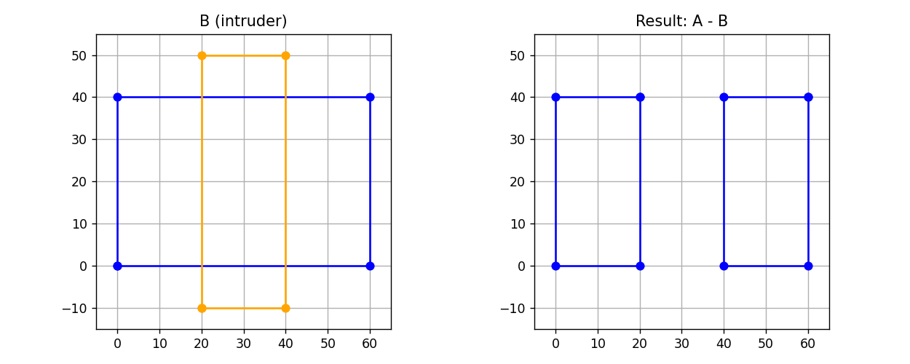

# 🧩 02 — DIFFERENCE

# 🧩 02 — DIFFERENCE

> 从实体区域中扣除被占用区域

在切片器中，`DIFFERENCE` 表示：

> **当前层的实体 − 侵入该层的其它物体**

这一步用于描述：

* 物体之间的相互穿插
* 模具 / 负空间
* 支撑或芯体对实体的切割
* 多材料之间的互相占用

---

## 1️⃣ 本例的几何语义

```python
A = [(0,0),(60,0),(60,40),(0,40)]   # 主体物体
B = [(20,-10),(40,-10),(40,50),(20,50)]  # 穿过主体的侵入物
```

几何含义是：

> 一个大矩形 A
> 被一个竖直矩形 B 从中间“切穿”

在真实切片中，这表示：

> 在这一层，物体 B 占用了 A 的一部分空间
> 那一部分 A 不能被打印

---

## 2️⃣ SUBJECT 与 CLIP 的语义

```python
pc.AddPath(scale(A), pyclipper.PT_SUBJECT, True)
pc.AddPath(scale(B), pyclipper.PT_CLIP, True)
```

含义是：

* `A` 是 **要打印的实体区域**`SUBJECT`
* `B` 是 **用来削减它的占用区域**`CLIP`

即：

> `SUBJECT − CLIP`

---

## 3️⃣ 执行 DIFFERENCE

```python
result = pc.Execute(pyclipper.CT_DIFFERENCE)
```

Clipper 在内部构造平面拓扑，并计算：

$$
A \setminus B
$$

输出的是：

> **在这一层中，A 去掉 B 后剩余的所有实体区域**

可能是一个，也可能是多个连通块。

---

## 4️⃣ 结果的语义

`result` 是一组闭合轮廓：

```python
[
  [ (x1,y1), (x2,y2), ... ],   # 左半部分
  [ (x1,y1), (x2,y2), ... ]    # 右半部分
]
```

虽然被分成两块，但它们在 slicer 语义上仍然是：

> **同一个材料 / 同一个打印层的实体**

这就是为什么在可视化中它们全部用**同一种颜色（蓝色）** 绘制。

---

## 5️⃣ 在切片器中的作用

`DIFFERENCE` 是 slicer 中的**负空间引擎**，用于：

| 场景      | 公式        |
| ------- | --------- |
| 内腔 / 中空 | 外壳 − 内部体积 |
| 模具      | 模具块 − 模芯  |
| 多物体遮挡   | A − B     |
| 多材料占用   | 主材料 − 次材料 |

---

## 一句话总结

> **`DIFFERENCE` = 在这一层中，从实体区域中移除被其它几何占用的部分。**

这是你切片器里
**构造真实材料分布的关键一步。**
