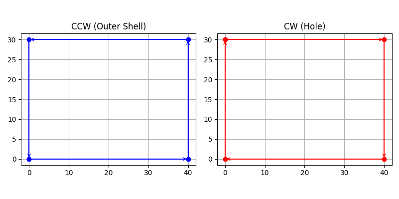

# 🧩 04 — Holes & Nesting（pyclipper 用法视角）

> 目标：
> 从 Clipper 的输出 `loops` 中，分离出
> **外轮廓（实体）** 和 **孔（空气）**

---

## 1️⃣ Clipper 布尔运算后你拿到什么？

不管你做的是：

```python
CT_UNION
CT_DIFFERENCE
CT_INTERSECTION
```

你最终得到的是：

```python
result = pc.Execute(...)
# result: List[List[(x,y)]]
```

也就是：

> 一堆**闭合多边形路径**

Clipper **不会**告诉你哪个是孔。

---

## 2️⃣ pyclipper 提供的关键 API

你要用的只有一个：

```python
pyclipper.Orientation(path)
```

用法：

```python
is_ccw = pyclipper.Orientation(path)
```

它返回：

| 返回值     | 含义       | 切片语义  |
| ------- | -------- | ----- |
| `True`  | CCW（逆时针） | 实体外轮廓 |
| `False` | CW（顺时针）  | 孔     |

---

## 3️⃣ 实战：从 loops 中分离外壳和孔

这是 slicer 中最标准的用法：

```python
outer_loops = []
hole_loops = []

for loop in loops:
    if pyclipper.Orientation(loop):
        outer_loops.append(loop)
    else:
        hole_loops.append(loop)
```

你现在得到了两个集合：

```text
outer_loops = 实体边界
hole_loops  = 空气边界
```

---

## 4️⃣ 你下一步会怎么用它们？

在 slicer 里：

```text
outer_loops → offset → 壁厚
hole_loops  → 跳过（不打印）
```

Infill 时：

```text
在 outer_loops 内填
排除 hole_loops
```

---

## 5️⃣ 你刚刚真正学会了什么？

不是 Orientation 这个函数，
而是这一句 slicer 级别的规则：

> **Clipper 用路径方向来编码“材料 vs 空气”。**

你只要正确用 `Orientation()`，
你的 slicer 就不会把洞填满。

---

## 一句话速记

> `Orientation(path) == True → 实体`
> `Orientation(path) == False → 孔`

这就是 pyclipper 在切片器里的**孔识别 API**。

