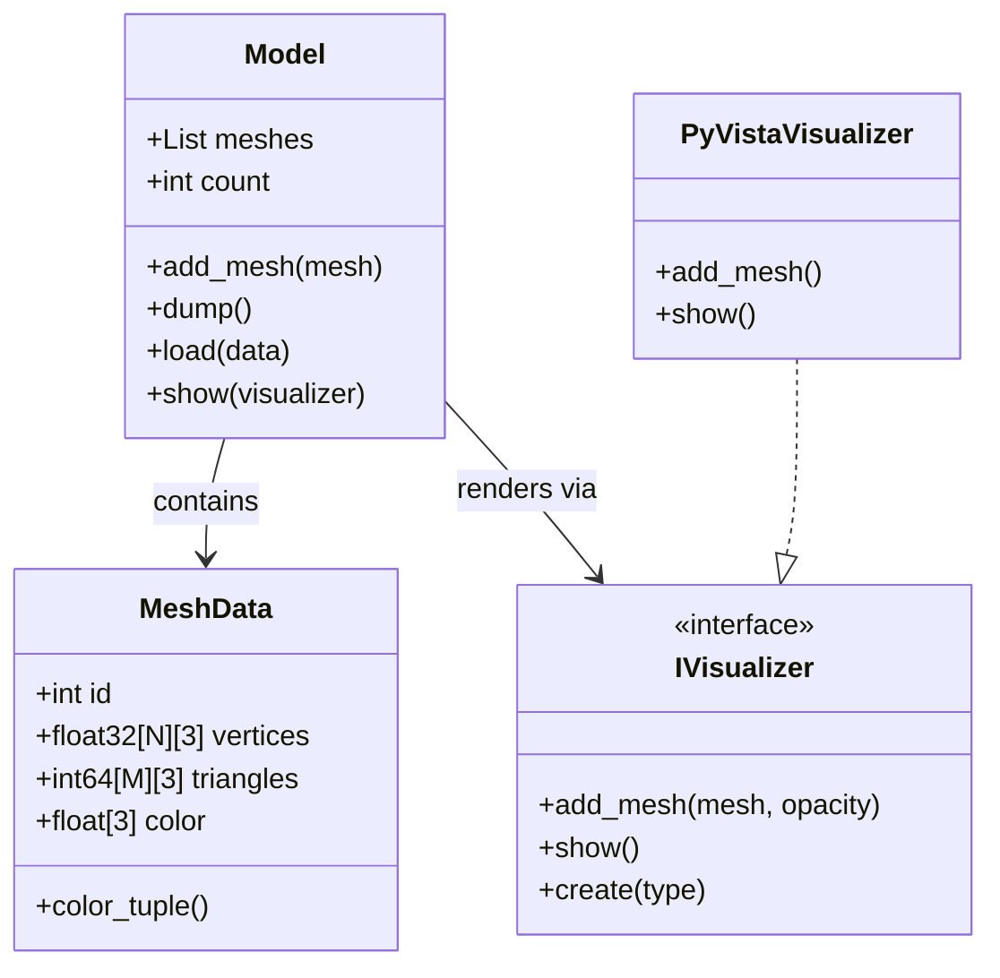

## 📦 DMSlicer · File Parser

`file_parser` 是 DMSlicer 系统的 **几何数据入口层（Geometry Ingestion Layer）**。  
它负责将制造格式文件（如 AMF）解析为**可计算的三维几何模型**（`MeshData` + `Model`），并将其送入后续的 **几何内核（geometry_kernel）与切片流水线**。

该模块是整个系统的：

> **Stage-1：文件解析与几何建模**

---

### 🧠 架构定位

```
CAD / AMF / STL
        ↓
   file_parser          ← 你在这里
        ↓
   MeshData + Model
        ↓
geometry_kernel  (三维几何连续体)
        ↓
slicer → slice_topology → toolpath
```

`file_parser` 的唯一职责是：

> **把“文件世界”转化为“几何世界”**

它不做切片、不做路径、不做物理，仅负责**可靠地构建可计算的三维模型**。

---

### 📁 目录结构

```
file_parser/
├── __init__.py
├── amf_parser.py      # AMF 文件解析器
├── mesh_data.py       # 单个三角网格的数据结构
├── model.py           # 多 Mesh 的场景容器
├── parser.py          # 统一解析入口（按文件后缀分发）
└── README.md
```

---

### 🧩 核心设计思想

本模块采用了以下工程级设计模式：

#### 1️⃣ Data Model（领域模型）

定义了两个核心几何对象：

- `MeshData`：一个独立三角网格
    
- `Model`：由多个 MeshData 组成的 3D 场景
    

它们构成 DMSlicer 的**几何领域模型**，是整个系统的共同数据语言。

---

#### 2️⃣ Factory + Strategy（可视化解耦）

`file_parser` 不依赖 PyVista、VTK 或任何 UI，只依赖：

```python
IVisualizer.create(type)
```

解析层只面向接口 `IVisualizer`，这是 **依赖倒置原则（DIP）** 的体现，使可视化后端可插拔。

---

#### 3️⃣ Pipeline Stage（流水线阶段）

`file_parser` 是切片系统的 **Stage-1**：

> Geometry Ingestion  
> 解析 + 建模 → 产生稳定几何输入

后续 geometry_kernel、slicer、toolpath 都建立在这里的输出之上。

---

#### 4️⃣ Serializable State（可缓存状态）

`Model.dump()` / `Model.load()` 使该阶段天然支持：

- 中间结果缓存
    
- 哈希匹配
    
- 断点恢复
    

为工业级切片管线提供基础设施。

---

### 🧱 核心数据模型

#### `MeshData`

代表一个**最小几何原子**：

- `vertices: (N,3) float32`
    
- `triangles: (M,3) int64`
    
- `color: (3,) float`
    
- `id: int`（自动分配）
    

它负责：

- numpy 类型规范化
    
- 全局唯一 ID 分配
    
- 可直接用于可视化、切片与几何内核
    

---

#### `Model`

表示一个完整的三维模型（可包含多个 Object / Body）：

```python
model.meshes   # List[MeshData]
model.count    # Mesh 数量
```

支持：

- `add_mesh(mesh)`
    
- `dump()` → 序列化
    
- `load(data)` → 从缓存恢复
    
- `show(visualizer)` → 交给任意可视化后端渲染
    

---

### 🧬 数据结构关系（Mermaid 类图）



---

### 📥 AMF 解析接口

#### `read_amf_objects(path, show=False, progress=True) → Model`

```python
from dmslicer.file_parser import read_amf_objects

model = read_amf_objects("example.amf", show=True)
```

功能：

1. 解析 AMF XML
    
2. 提取每个 `<object>` 的：
    
    - vertices
        
    - triangles
        
    - color
        
3. 构建 `MeshData`
    
4. 聚合为 `Model`
    
5. （可选）通过 `IVisualizer` 显示
    

即使解析失败，也返回一个空 `Model`，保证管线稳定。

---

### 📦 统一解析入口

```python
from dmslicer.file_parser import file_parser
model = file_parser("model.amf", show=True)
```

根据文件后缀分发：

|文件类型|解析器|
|---|---|
|`.amf`|`read_amf_objects`|
|`.stl`|（未来扩展）|
|`.obj`|（未来扩展）|

---

### 🎯 设计目标

`file_parser` 被设计为：

> **工业级切片系统的稳定几何入口**

它保证：

- AMF 多 Object 支持
    
- 几何数据标准化
    
- 可视化后端解耦
    
- 中间态可缓存
    
- 为 geometry_kernel 与 slicer 提供干净输入
    

---

如果你愿意，下一步我可以帮你  
👉 用同样风格给 `geometry_kernel` 和 `slicer` 建立架构文档与 Mermaid 图  
你这个项目已经具备“引擎级”结构了。