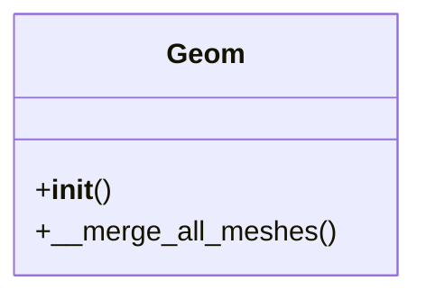

```
src/dmslicer/geometry_kernel/
│
├── __init__.py
│
├── geom_kernel.py
│   # 你现在 Part 类的主体
│   # 全局顶点、三角、ID、block、object 映射
│
├── topology3d.py
│   # 原 __topo_build
│   # vert → triangles
│   # edge → triangles
│   # 面邻接
│
├── spatial_index.py
│   # z_min, z_max, z-sorted triangles
│   # 平面快速查询
│
├── intersection.py
│   # triangle–triangle overlap
│   # plane–triangle intersection
│   # clipping
│
└── mesh_normalize.py
    # 顶点去重
    # index remap
    # triangle canonicalization
```
## `canonicalize.py` 规范化


### `__init__`初始化
### 

