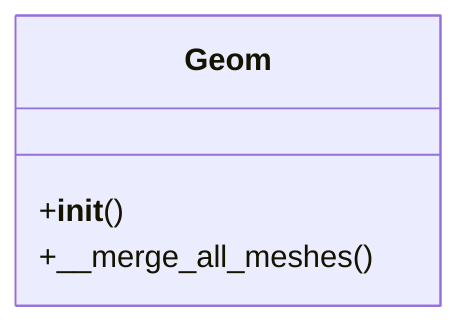

```
src/dmslicer/geometry_kernel/
│
├── __init__.py
│
├── geom_kernel.py
│   # 你现在 Part 类的主体
│   # 全局顶点、三角、ID、block、object 映射
│
├── topology3d.py
│   # 原 __topo_build
│   # vert → triangles
│   # edge → triangles
│   # 面邻接
│
├── spatial_index.py
│   # z_min, z_max, z-sorted triangles
│   # 平面快速查询
│
├── intersection.py
│   # triangle–triangle overlap
│   # plane–triangle intersection
│   # clipping
│
└── mesh_normalize.py
    # 顶点去重
    # index remap
    # triangle canonicalization
```
## `canonicalize.py` 规范化


### `__init__`初始化
###

### transforms.py
- 提供基础几何变换工具函数。
- rotate_z_to_vector(v): 返回 3×3 旋转矩阵，使世界 Z 轴旋转到方向 v。
  - 依赖: numpy
  - 用法示例:
    ```python
    from dmslicer.geometry_kernel import rotate_z_to_vector
    import numpy as np

    R = rotate_z_to_vector([1.0, 1.0, 1.0])
    z = np.array([0.0, 0.0, 1.0])
    u = np.array([1.0, 1.0, 1.0]) / np.linalg.norm([1.0, 1.0, 1.0])
    assert np.allclose(R @ z, u)
    ```
